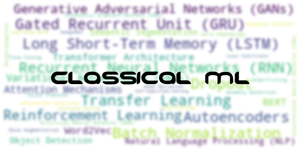
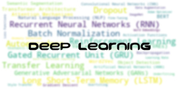

This prints a line below.

---

# Getting Started

- Add bullets
- Add `hilighted text`
- Take the post-lecture quiz.
- Complete the challenge.
- Complete the assignment.
- After completing a lesson group, visit the [Discussion Board](https://github.com/microsoft/ML-For-Beginners/discussions) and "learn out loud" by filling out the appropriate PAT rubric. A 'PAT' is a Progress Assessment Tool that is a rubric you fill out to further your learning. You can also react to other PATs so we can learn together.

> 🌍 Add notes like this. 🌍

---